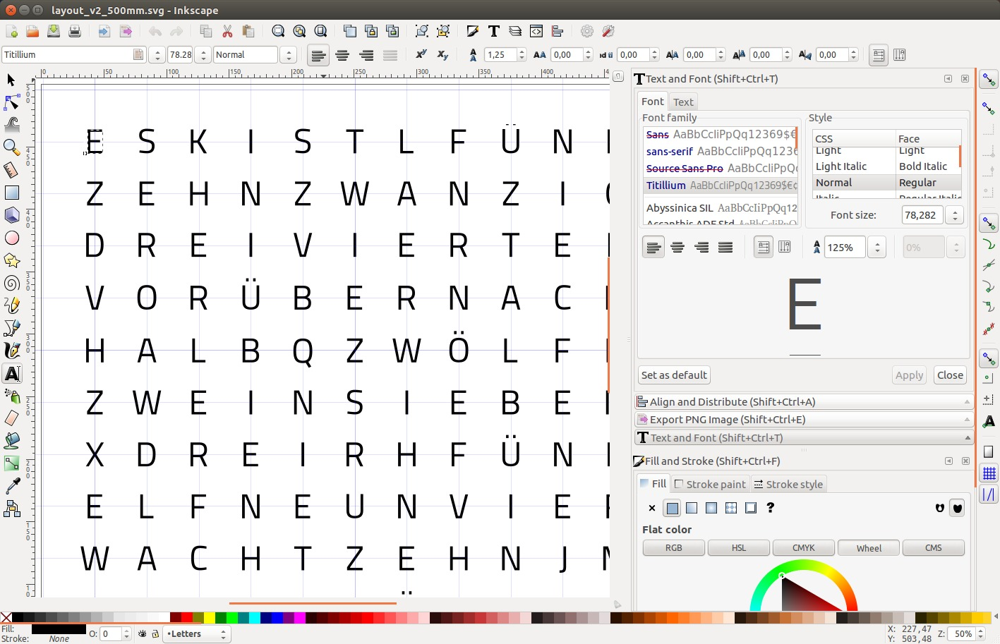
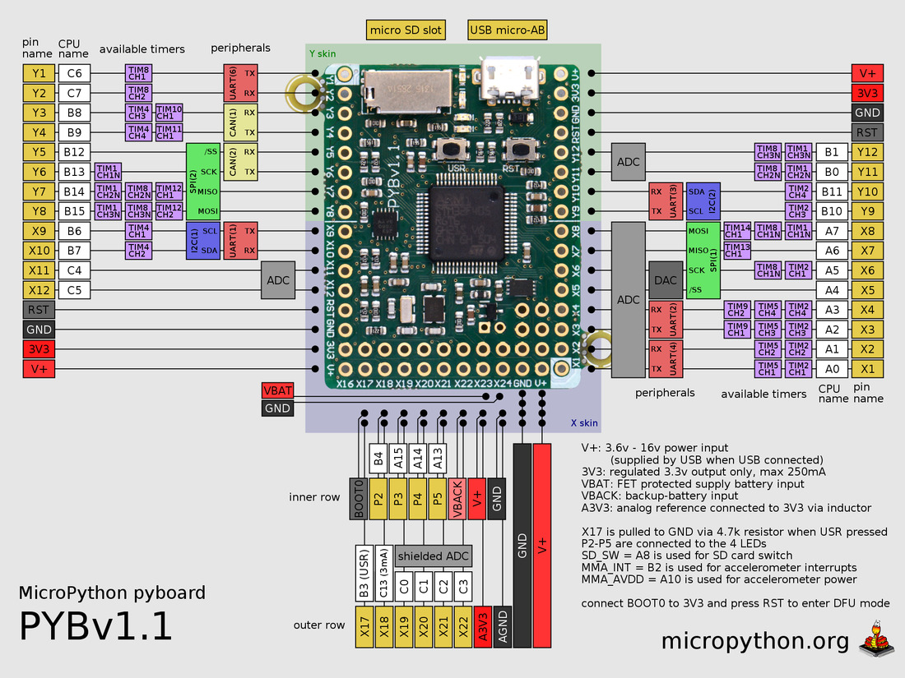
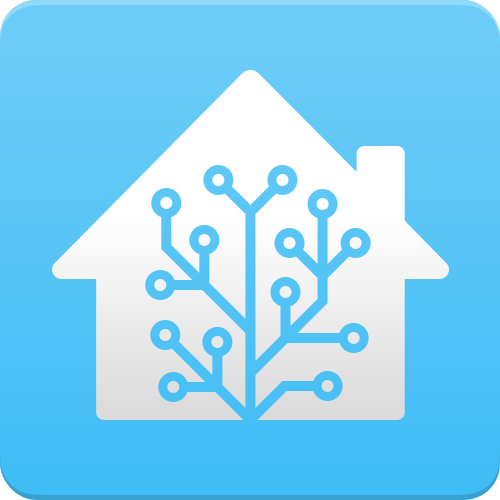
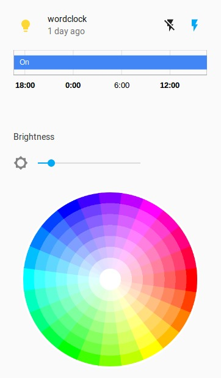

# Making a Wordclock
### using Python to show the time in style


## Overview
- Letter Matrix
- Programming: Python/Micropython
- Microcontrollers
- other Hardware
  - Case
  - LEDs
  - LED-separation


# The matrix


## The basic concept
- Use a matrix of letters to display the time
- Words are lit up to give the time in a sentence
note: FIXXXXXME more specific


## Designing the matrix<!-- .slide: data-background-image="imgs/first_matrix_handdrawn_no_light.jpg"  style="text-align:center" --> <!-- .element: class="shadow" -->


<!-- .slide: data-background-image="imgs/first_matrix_handdrawn_no_light.jpg"  style="text-align:center" --> <!-- .element: class="shadow" -->
note: evenly spaced, no joining words that we need in a row, all times displayable. choose font.


## Designing the matrix
[<!-- .element: style="width:40%" -->](https://inkscape.org)
note: Adobe Illustrator


[<!-- .element: style="height:80%" -->](https://inkscape.org)


<!-- .slide: data-background-image="imgs/first_printout_with_error.jpg"  style="text-align:center" --> <!-- .element: class="shadow" -->
note: paper printout


# Font
[Titillium](https://www.fontsquirrel.com/fonts/TitilliumText), licensed under [OFL](https://en.wikipedia.org/wiki/SIL_Open_Font_License)


note: italienische Schriftart (OFL); Urbino, I


<!-- .slide: data-background-image="imgs/first_printout_with_error_lit.jpg"  style="text-align:center" --> <!-- .element: class="shadow" -->
note: almost makes sense - typo


<!-- .slide: data-background-image="imgs/first_printout_with_error_lit2.jpg"  style="text-align:center" --> <!-- .element: class="shadow" -->
note: 26 leds vs 114


<!-- .slide: data-background-image="imgs/lasercut_seperators_23cm.jpg"  style="text-align:center" --> <!-- .element: class="shadow" -->


<!-- .slide: data-background-video="imgs/lasercut_seperators_no_sound.mp4" data-background-video-loop="loop" --><!-- .element:  class="light shadow" --> <!-- lasercut seperators -->


<!-- .slide: data-background-image="imgs/lasercut_seperators_23cm_2.jpg"  style="text-align:center" --> <!-- .element: class="shadow" -->
note: 11x11, LEDs?


<!-- .slide: data-background-image="imgs/lasercut_seperators_50cm.jpg"  style="text-align:center" --> <!-- .element: class="shadow" -->


# LEDs <!-- .slide: data-background-image="imgs/ws2812b_1.jpg"  style="text-align:center" --> <!-- .element: class="shadow higher" -->
note: ws2812b, grb, daisy chained


<!-- .slide: data-background-image="imgs/ws2812b_2.jpg"  style="text-align:center" --> <!-- .element: class="shadow" -->


## WS2812b
- chainable RGB-LEDs
- individually addressable
- MicroPython [driver](https://github.com/micropython/micropython/blob/master/ports/esp8266/modules/neopixel.py), RaspberryPi [driver](https://github.com/jgarff/rpi_ws281x)
- come on strips or as single LEDs


<!-- .slide: data-background-image="imgs/first_protype_matrix.jpg"  style="text-align:center" --> <!-- .element: class="shadow" -->


<!-- .slide: data-background-image="imgs/single_ws2812b_on_seperators.jpg"  style="text-align:center" -->


<!-- .slide: data-background-image="imgs/single_ws2812b_backs.jpg"  style="text-align:center" -->
note: try to avoid single LEDs, if not fond of soldering


<!-- .slide: data-background-image="imgs/single_leds_closeup.jpg"  style="text-align:center" -->


<!-- .slide: data-background-image="imgs/single_leds_lit.jpg"  style="text-align:center" -->


<!-- .slide: data-background-image="imgs/single_leds_matrix_part_lit.jpg"  style="text-align:center" -->


## Frame <!-- .slide: data-background-image="imgs/frame_23cm.jpg"--><!-- .element: class="light shadow higher" -->
note: 5 €


## Frame  <!-- .slide: data-background-image="imgs/frame_50cm.jpg"--><!-- .element: class="light shadow" -->
note: 16 €


# Micropython <!-- .slide: data-background-image="imgs/micropython_headline.jpg"  style="text-align:left" --> <!-- .element: class="shadow" -->
### Python for Microcontrollers


## <i class="twa twa-snake twa-1x"></i> Micropython
- <i class="fa fa-microchip" aria-hidden="true"></i> [Kickstarter in 2014](https://www.kickstarter.com/projects/214379695/micro-python-python-for-microcontrollers), by Damien George
  - Python 3, Open Source Hardware ([micropython.org](https://micropython.org/))
  - ARM chip, 192MB RAM
  - £28.0, ~€32 per board (v1.1)


<!-- .element: style="width:75%;" -->
Note: ARM chip, 192 MB RAM, €32 per board


## <i class="twa twa-snake twa-1x"></i> Micropython
  - fits in 265k of code space and 16k of RAM
  - small file system
  - boot.py, main.py
  - include other libs


## <i class="twa twa-snake twa-1x"></i> Micropython
```python
import pyb

# turn on an LED
pyb.LED(1).on()
# print some text to the serial console
print('Hello MicroPython!')
```


## <i class="twa twa-snake twa-1x"></i> Micropython
```python
from machine import Pin

# create an I/O pin in output mode
p = Pin('X1', Pin.OUT)

# toggle the pin
p.high()
p.low()
```


## <i class="twa twa-snake twa-1x"></i> Micropython
```python
import os

# list root directory
print(os.listdir('/'))

# print current directory
print(os.getcwd())

# open and read a file from the SD card
with open('/sd/readme.txt') as f:
    print(f.read())
```


## <i class="twa twa-snake twa-1x"></i> Micropython
```python
# full range of numeric types
# small integer (fits in a machine word)
>>> 123
123
# big integer
>>> 1 << 160
1461501637330902918203684832716283019655932542976
# floating point
>>> 1.23e6
1230000.0
# complex numbers
>>> (1 + 2j) * 4j
(-8+4j)
```
Note: BUT cheap!!!


### no network <i class="twa twa-crying-face twa-1x"></i>
but we want to:
- get time via [NTP](https://en.wikipedia.org/wiki/Network_Time_Protocol)
- control colors and brightness via network


## <i class="twa twa-snake twa-1x"></i> Micropython

- 2016, [2nd Kickstarter](https://www.kickstarter.com/projects/214379695/micropython-on-the-esp8266-beautifully-easy-iot)
  - software only
  - port of µPy to [ESP8266](https://en.wikipedia.org/wiki/ESP8266)
Note:  teensy, arm, esp8266, unix


# <!-- .slide: data-background-image="imgs/esp_03.jpg" -->
Note: ESP-03, tiny, but no power handling, no serial, 32bit, 16GPIO, one ADC,


# ESP8266
- <i class="fa fa-wifi" aria-hidden="true"></i> WIFI enabled
- 32bit @ 80 Mhz
- 16 [GPIO](https://en.wikipedia.org/wiki/GPIO) pins
- one 10-bit [ADC](https://en.wikipedia.org/wiki/Analog-to-digital_converter)
- cheap: ~$2


## ESP8266 Versions
- ESP modules:
  - ESP-12, ESP-12E: 4MiB flash memory, </br>ESP-12F: better antenna
- others (with UART to USB):
  - NodeMCU Devboard (Lua): ~$3-4
  - WeMos D1, D1 mini (Pro)
  - Adafruit Huzzah ESP8266
Note: Shields, antenna version **ceramic**/**PCB trace**, USB includes power from 5V to 3V


<!-- .slide: data-background-image="imgs/nodemcu_v2.jpg" -->
Note: NodeMCU v2; $4; micro USB


## 23x23cm Wordclock
- uses NodeMCU with MicroPython
  - [custom built firmware](https://github.com/micropython/micropython/tree/master/ports/esp8266#build-instructions)
- MQTT for control, to integrate into home automation


# MQTT
- message protocol for telemetry
- ISO/IEC PRF 20922
- subscribe/publish to topics via message broker
- for wireless networks with low bandwidth and unreliable connections
Note: https://mosquitto.org/;  Message Queue Telemetry Transport


# MQTT (2)
- topic: mylocation/device/sensor
  - e.g: home/wordclock/color<!-- .element: class="fragment" data-fragment-index="1" -->
- last will and testament<!-- .element: class="fragment" data-fragment-index="2" -->
- QoS: 0 (most once), 1 (at least once), 2 (exactly once)<!-- .element: class="fragment" data-fragment-index="3" -->
- retained messages<!-- .element: class="fragment" data-fragment-index="4" -->
Note: LWT is stored by broker to broadcast on ungraceful disconnect


# MQTT (3)
- switching devices with MQTT
- bidirectional communication
- device subscribes to topic
- publish to topic to switch device


### integrate with Home assistant
[<!-- .element: style="width:30%;" -->](https://home-assistant.io)


<!-- .element: style="width:30%" -->


<!-- .slide: data-background-image="imgs/first_protype_matrix2.jpg"  style="text-align:center" -->


<!-- .slide: data-background-image="imgs/lasercut_paper_face.jpg"  style="text-align:center" -->


<!-- .slide: data-background-image="imgs/paper_wordclock_23cm.jpg"  style="text-align:center" -->


<!-- .slide: data-background-image="imgs/paper_wordclock_23cm_blue.jpg"  style="text-align:center" -->


<!-- .slide: data-background-image="imgs/word_matrix_paper_vs_vinyl.jpg"  style="text-align:center" -->


<!-- .slide: data-background-image="imgs/vinyl_0.jpg"  style="text-align:center" -->


<!-- .slide: data-background-image="imgs/vinyl_1.jpg"  style="text-align:center" -->


<!-- .slide: data-background-image="imgs/vinyl_2.jpg"  style="text-align:center" -->


<!-- .slide: data-background-image="imgs/vinyl_3.jpg"  style="text-align:center" -->


<!-- .slide: data-background-image="imgs/vinyl_4.jpg"  style="text-align:center" -->


<!-- .slide: data-background-image="imgs/random_colors_50cm.jpg"  style="text-align:center" -->


# RTC <!-- .slide: data-background-image="imgs/rtc_i2c.jpg" --><!-- .element: class="light higher shadow" -->
note: quartz crystal to keep time. DS1307 (I2C clock)


<!-- .slide: data-background-image="imgs/rtc_i2c_2.jpg" -->


# Two wordclocks
- Micropython / Python (Raspbian)
- ESP8266 / RaspberryPi zero W
- both with WS2812b
- strips / single LEDs
- RTC / only network


# Clock
```python
class clock():
  self.words = {  
      "es":0, "ist":3,
      "fünf_pre":7, "zehn_pre":11, "zwanzig":15,
      "dreiviertel":22, "viertel":26,
      "vor":33, "über":36, "nach":40,
      "halb":44,
      # ...
      "zehn":93,
      "uhr":107}
```


```python
# arrow == great time lib
# class clock
  def get_time(self):
      now = arrow.now()
      hour = now.hour
      minute = now.minute
      second = now.second
      return (hour, minute, second)
```


```python
# class clock
  def show_time(self,h,m,val=DEFAULT_COLOR):
      """show time on matrix, expects int for h and m"""
      full = False # exactly full hour
      string = "es ist "
      h = h%12
      # minute
      if m >= 5 and m < 10:
          string += "fünf nach "
      if m >= 10 and m < 15:
          string += "zehn nach "
      if m >= 15 and m < 20:
          string += "viertel "
          h = (h+1)%12
      if m >= 20 and m < 25:
          string += "zwanzig nach "
      if m >= 25 and m < 30:
          string += "fünf vor halb "
          h = (h+1)%12
      if m >= 30 and m < 35:
          string += "halb "
          h = (h+1)%12
      if m >= 35 and m < 40:
          string += "fünf nach halb "
          h = (h+1)%12
      if m >= 40 and m < 45:
          string += "zwanzig vor "
          h = (h+1)%12
      if m >= 45 and m < 50:
          string += "dreiviertel "
          h = (h+1)%12
      if m >= 50 and m < 55:
          string += "zehn vor "
          h = (h+1)%12
      if m >= 55 and m <= 59:
          string += "fünf vor "
          h = (h+1)%12
      if m >= 0 and m < 5:
          full = True

      hourstrings = [ "zwölf",
                      "ein",
                      "zwei",
                      "drei",
                      "vier",
                      "fünf",
                      "sechs",
                      "sieben",
                      "acht",
                      "neun",
                      "zehn",
                      "elf",
                      "zwölf"]
      string += hourstrings[h%12]
      if h == 1 and not full:
              string += "s"
      if full:
          string += " uhr"
      self.show_time_str(string,m%5,val)
```


```python
# class clock
  def show_time_str(self,string,minutes=0,val=DEFAULT_COLOR):
      self.d.clear(show=False) # clear but don't update

      # clear buffer
      self.clear_buffer()

      string = string.lower()
      string = string.strip()
      str_words = string.split()
      if "es ist zehn vor" in string or\
         "es ist fünf vor" in string or\
         "es ist zehn nach" in string or\
         "es ist fünf nach" in string:
          # first zehn or fünf is pre
          str_words[2] += "_pre"

      for word in str_words:
          if "_pre" in word:
              length = len(word) - 4
          else:
              length = len(word)
          self.set_word(self.words[word],length,val)
      self.set_minutes(minutes,val)
      self.write_words()
      self.d.show()

```


```python
# class clock
  def set_word(self,z,length,val=DEFAULT_COLOR):
      """gets z coordinate (like in array) and length,
         optional val for color"""
      for i in range(0,length):
          x = z%self.d.WIDTH+i
          y = z//self.d.WIDTH
          self.buffer[x][y] = val
```


# TODO

- try different ESP8266, ESP32 boards
  - D1 mini (4MB Flash)
- release source code
- fix (hardware-)bugs with RaspberryPi version
- implement more features for RaspberryPi version


## Avoid messing up the word matrix <!-- .slide: data-background-image="imgs/vinyl_messup.jpg"  style="text-align:center" -->


<!-- .slide: data-background-iframe="https://www.youtube.com/embed/XH2xVZ04xGs"  -->


## Thanks for your attention <!-- .slide: data-background-image="imgs/python.jpg" --><!-- .element:  class="light shadow" -->


<!-- .slide: data-background-image="imgs/boats_from_above.jpg" style="text-align:left" class="dark "-->
[@flowolf](https://twitter.com/flowolf)</br>
[blog.flo.cx](https://blog.flo.cx)


<!-- .slide: data-background-iframe="https://www.youtube.com/embed/VxUaKYoNCyA"  --><!-- .element:  class="light shadow" --> <!-- rainbow effect -->
